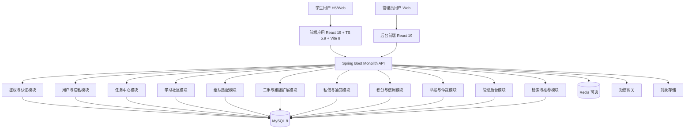
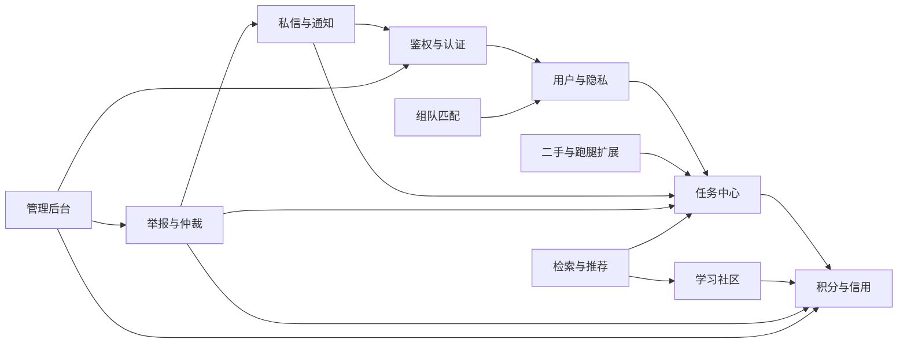

# CampusHub 架构设计文档

> 来源标注：`[AI生成]`  
> 对齐文档：`docs/P1/软件需求规格说明书.md`、`docs/P1/用户故事.md`、`docs/P1/调研原始数据.md`

## 1. 架构概览

### 1.1 架构风格与约束映射

- 架构风格：模块化单体（Modular Monolith），单仓库、单后端进程、按业务域分模块开发与部署。`[AI生成]`
- 选择理由（可验证）：
  1. 团队规模 4 人、阶段工时约 48 人时，微服务会引入网关、注册发现、分布式链路追踪等额外运维负担，超出当前工时上限。`[AI生成]`
  2. P1 硬约束要求避免过度设计（禁止服务网格、分布式事务等），模块化单体可满足并发目标 `>=2000` 与月可用性 `>=99%`。`[AI生成]`
  3. 与既定技术栈完全一致：React 19 + Spring Boot + MySQL 8。`[AI生成]`

### 1.2 总体架构图



### 1.3 运行与容量基线（量化）

| 指标 | 目标值 | 验证方式 | 备注 |
|------|--------|----------|------|
| 峰值并发用户数 | `>=2000` | 压测脚本模拟 2000 并发会话，核心接口错误率 `<1%` | `[AI生成]` |
| 月可用性 | `>=99%` | 月度 uptime 统计（可用分钟/总分钟） | `[AI生成]` |
| 核心接口响应 | P95 `<=2s`（查询类） | 对 `任务大厅`、`课程评价列表` 压测取 P95 | 对齐 SRS 4.1 |
| 超时状态流转精度 | `<=5分钟` | 定时任务日志比对任务截止时间 | 对齐 US-19 |
| 仲裁后积分结算时延 | `<=10秒` | 仲裁操作日志与积分流水时间差 | 对齐 US-18 |

---

## 2. 模块划分说明

### 2.1 模块清单与职责边界

| 模块 | 核心职责 | 输入（示例） | 输出（示例） | 调用方式 |
|------|----------|--------------|--------------|----------|
| 鉴权与认证模块 | 手机号注册登录、短信验证码校验、学生证人工审核状态流转 | `phone:string(11)`、`code:string(6)`、`studentCardImage:multipart<=3 files` | `token:string`、`verifyStatus:pending/approved/rejected` | REST + DB |
| 用户与隐私模块 | 昵称管理、隐私开关（历史任务/接单/评价默认隐藏）、前台脱敏展示 | `nickname:string(2-20)`、`privacyFlags:object` | `publicProfile:{nickname,verifiedTag}` | REST |
| 任务中心模块 | 发单、抢单、状态机流转、并发接单控制、自接限制 | `taskCreateDTO`、`taskAcceptDTO` | `taskId`、`status` | REST + 事务 |
| 二手与跑腿扩展模块 | 二手商品字段扩展、跑腿场景字段扩展、图片 EXIF 清洗 | `images:list<=9`、`deliveryDeadline:datetime` | `tradeTaskDetail` | REST + 对象存储 |
| 学习社区模块 | 资料上传、课程评价、辅导任务发布与违禁词拦截 | `file<=50MB`、`courseRating` | `resourcePost`、`courseScore` | REST + 异步扫描 |
| 组队匹配模块 | 招募发布、技能标签匹配、申请审核、限频 | `tags:list(1..5)`、`applyReason<=200` | `teamPostStatus` | REST |
| 私信与通知模块 | 站内 IM、系统通知、任务关联会话 | `message:text/image` | `conversationId`、`unreadCount` | REST + 可选 WebSocket |
| 积分与信用模块 | 积分冻结/结算/解冻、信用分规则、阈值限制、申诉计次 | `scoreDelta:int`、`appealRequest` | `creditScore`、`appealStatus` | 服务内调用 + REST |
| 举报与仲裁模块 | 举报处理、差评申诉、证据管理、管理员裁决执行 | `reportDTO`、`arbitrationAction` | `arbitrationResult` | REST + 事务 |
| 管理后台模块 | 认证审核、内容审核、封禁、配置管理、操作审计 | `adminCommand` | `operationLogId` | REST |
| 检索与推荐模块 | 多维筛选、关键词检索、热门榜（低优先） | `query:string`、`filters` | `pagedList`、`hotList` | REST + 定时任务 |

### 2.2 模块依赖关系图



### 2.3 关键模块接口定义（可测试）

#### 2.3.1 鉴权与认证模块

- `POST /api/auth/send-code`
  - 请求：`{ "phone": "string(11)" }`
  - 响应：`{ "requestId": "string(32)", "expireSeconds": 300 }`
  - 约束：同手机号 `60s` 内最多 1 次；同 IP `60s` 内最多 5 次；单手机号 `24h` 内最多 20 次；单 IP `24h` 内最多 200 次。`[human-written]`
- `POST /api/auth/login-by-code`
  - 请求：`{ "phone":"string(11)", "code":"string(6)" }`
  - 响应：`{ "token":"jwt", "expiresIn": 7200, "verifyStatus":"pending|approved|rejected" }`
- `POST /api/auth/student-verification`
  - 请求：`multipart/form-data`，`cardType:enum`，`realName:string(2..20)`，`studentNo:string(6..20)`，`images<=3`
  - 响应：`{ "verifyTicket":"string(32)", "status":"pending" }`

#### 2.3.2 任务中心模块

- `POST /api/tasks`
  - 请求：`taskType:enum`、`title:string(5..60)`、`detail:string(10..1000)`、`rewardPoint:int(>=0)`、`deadline:datetime`
  - 响应：`{ "taskId":"long", "status":"PENDING_ACCEPT" }`
  - 校验：信用分 `<60` 返回 `403`；积分不足返回 `409`。
- `POST /api/tasks/{taskId}/accept`
  - 并发控制：基于 `version` 乐观锁，确保同一任务仅 1 人成功接单。
  - 响应：成功 `200`；失败返回 `409 TASK_ALREADY_ACCEPTED`。
- `POST /api/tasks/{taskId}/complete-proof`
  - 请求：完成凭证图片 `<=3`、说明 `<=300`
  - 响应：`{ "status":"WAIT_CONFIRM" }`

#### 2.3.3 积分与信用模块

- `POST /api/credits/appeals`
  - 请求：`badReviewId:long`、`evidenceImageUrls:list<=5`、`statement:string(<=500)`
  - 规则：差评后 `7日` 内可发起；同事件最多 `3次`。
  - 响应：`{ "appealId":"long", "status":"PENDING" }`
- `GET /api/credits/me`
  - 响应：`{ "creditScore":int, "dailyAcceptLimit":int, "canPublish":boolean, "canAccept":boolean }`
  - 规则映射：`<80` 每日限接 1 单；`<60` 禁止发布与接单。

#### 2.3.4 隐私与公开信息输出约束（全局）

- 公开接口统一输出结构：
  - `publicUser = { "nickname":"string", "verifiedTag":true|false }`
- 严禁在前台 API 返回字段中出现：
  - `realName`、`studentNo`、`idCardNo`。  
- 默认隐私配置：
  - `hidePublishedHistory=true`
  - `hideAcceptedHistory=true`
  - `hideCourseReviews=true`

### 2.4 数据一致性与异常流（补缺）

- 任务状态流转采用单库事务，状态机：`待接单 -> 进行中 -> 待确认 -> 已完成`。`[AI生成]`
- 取消与超时场景触发积分解冻或保持冻结待仲裁，要求积分流水与任务状态在同一事务提交。`[AI生成]`
- `[human-written]` 短信网关失败重试策略：同步重试最多 `2` 次，指数退避 `1s/3s`；连续失败后返回错误码 `SMS_SEND_FAILED`，前端显示“验证码发送失败，请 60 秒后重试”，并记录告警日志。
- `[human-written]` 对象存储上传失败补偿策略：上传分两阶段（先上传文件后落库）；任一阶段失败立即回滚业务事务并删除已上传临时对象；补偿清理任务每 `60` 分钟扫描一次临时桶，删除创建时间超过 `24` 小时的孤儿文件。

---

## 3. 技术选型说明

### 3.1 技术选型表（与约束映射）

| 层次 | 选择 | 选择理由（可验证） | 约束映射 |
|------|------|--------------------|----------|
| 前端框架 | React 19 + TypeScript 5.9 + Vite 8 + ESLint 9 | 与 P1 定稿栈一致；可直接复用现有脚手架与规范，减少迁移工时 | 技术栈基线不可更改 |
| 后端框架 | Java 17 + Spring Boot + Maven | 成熟单体开发模式，支持模块化分层与事务，满足学生团队可维护性 | 禁止过度设计，4 人团队可维护 |
| 数据库 | MySQL 8 | 单库事务便于任务状态+积分流水一致性，降低分布式复杂度 | 禁止分布式事务 |
| 缓存（可选） | Redis 7（可选启用） | 缓存热点列表（任务大厅、课程评价）可降低 DB 读压；不开启也可先验收功能 | 并发 `>=2000` 支撑；非强制 |
| 消息队列 | 暂不引入独立 MQ | 当前规模下可由 Spring 异步任务 + 定时任务承担通知与超时扫描 | 避免超额运维复杂度 |
| 文件存储 | 对象存储（MinIO/云 OSS 二选一） | 学生证、资料附件、凭证图片需持久化；支持上传大小与类型校验 | 资料上传、审核流程需求 |
| 短信服务 | 第三方 SMS Provider | 鉴权硬约束要求短信验证码，必须接入可用短信通道 | 认证方式硬约束 |
| 部署方式 | 单机 Docker Compose（Nginx + FE + API + MySQL + 可选 Redis） | 可在校园内网或轻量云服务器落地；部署步骤可脚本化，满足 `99%` 月可用性目标 | 工程规模与运维能力匹配 |
| 可观测性 | 基础日志 + 审计表 + 健康检查 | 关键流程（认证审核、积分流转、仲裁）可追踪，可用于验收和排障 | 可测试、可审计 |

### 3.2 部署拓扑（建议）

```text
Client(H5/Web)
   |
Nginx (TLS termination, static hosting, reverse proxy)
   |
Spring Boot App (modular monolith)
   |
MySQL 8 (primary)
   +-- Redis (optional)
   +-- Object Storage (MinIO/OSS)
   +-- SMS Provider
```

### 3.3 架构约束自检清单

| 检查项 | 结果 | 证据 |
|--------|------|------|
| 是否引入 SSO/CAS/OAuth2/教务 API | 否 | 认证接口仅 `phone + sms + 人工审核` |
| 是否出现真实货币托管/分账 | 否 | 仅 `point` 积分字段与流水 |
| 前台是否暴露真实姓名/学号 | 否 | 公开结构统一 `nickname + verifiedTag` |
| 信用规则是否完整 | 是 | 初始 100；`+1/-5/-30`；`<80` 限单；`<60` 禁发禁接；7日3次申诉 |
| 是否过度设计（分布式事务/服务网格） | 否 | 模块化单体 + 单库事务 |
| 是否满足并发/可用性目标 | 是（目标定义完成） | 明确 `>=2000`、`>=99%` 与压测验证方案 |

---

## 4. 验收与测试要点（架构级）

- 压测场景 A：`POST /api/tasks/{id}/accept`，并发 500 抢同一批任务，重复接单率必须为 `0`。`[AI生成]`
- 压测场景 B：任务大厅与课程评价查询并发 2000，P95 响应 `<=2s`，错误率 `<1%`。`[AI生成]`
- 安全检查 A：抓包与接口契约校验，前台响应体不含 `realName/studentNo` 字段。`[AI生成]`
- 规则检查 A：构造信用分 `79` 与 `59` 账号，验证“每日限接 1 单”与“禁止发布接单”是否生效。`[AI生成]`
- 规则检查 B：差评后第 8 天发起申诉应失败；同事件第 4 次申诉应失败。`[AI生成]`

---

## 5. 结论与下一步

- 本方案在不改变既定技术栈与 P1 决策前提下，给出可实现、可测试、可运维的模块化单体架构。`[AI生成]`
- `[human-written]` 定稿实现决策：  
  1) Redis：`P2 阶段默认不启用`，仅保留配置开关；功能实现不得依赖 Redis。  
  2) 短信网关：采用 `阿里云短信服务`，验证码模板 1 个，预算上限 `300 元/月`。  
  3) 对象存储：采用 `MinIO`（校园内网/云服务器自部署），桶划分为 `verify-material`、`task-proof`、`study-resource` 三类。

