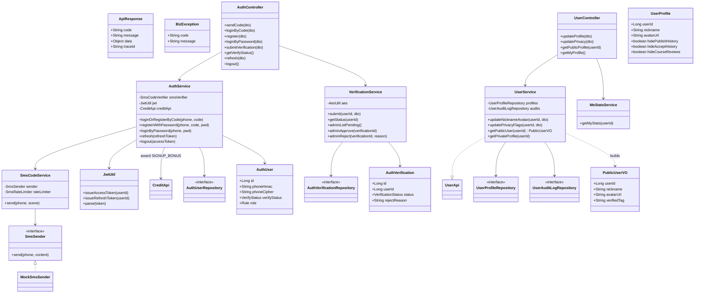
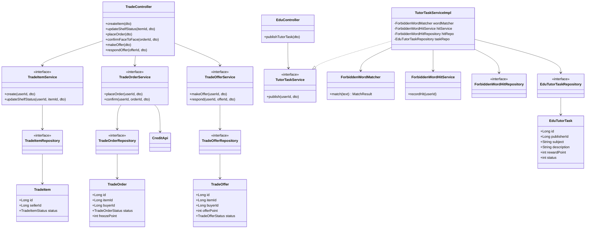
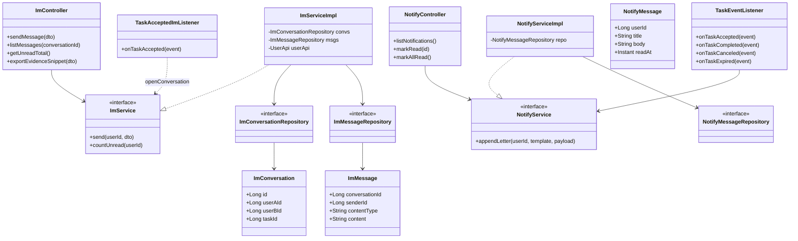
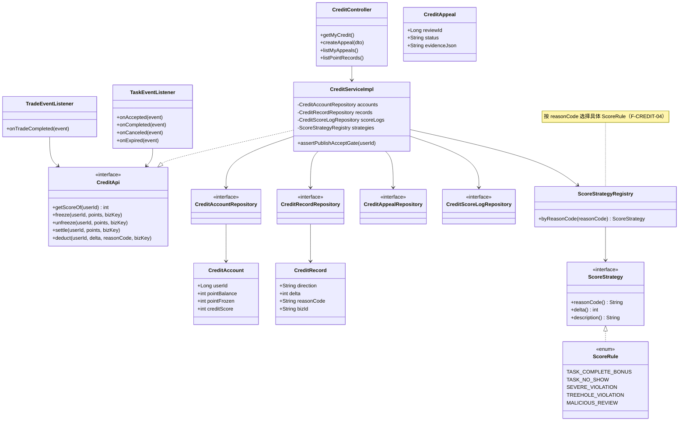
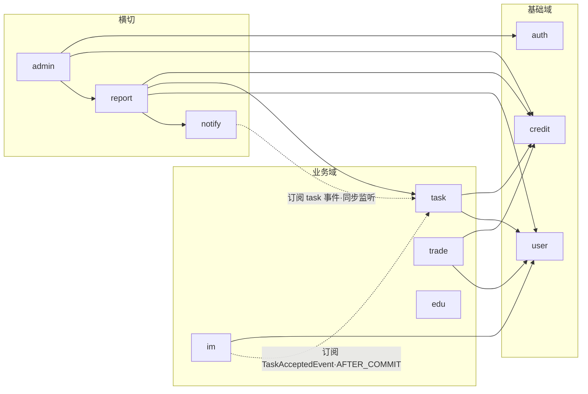

# P3 核心类图（P0 范围）

> **渲染说明：** 正文使用 **Mermaid `classDiagram`**。在 GitHub、VS Code（Markdown 预览）、Cursor 中可直接渲染。若需打印或复杂排版，可再导出为 PlantUML（`docs/P3/类图/` 目录可按需补图）。
>
> **依据：** [P2 架构设计文档](../P2/架构设计文档.md)（模块化单体、`XxxApi` + `ApplicationEvent`）、[P1 SRS](../P1/软件需求规格说明书.md)、[02_功能映射主表](./02_功能映射主表.md) 中 **✓（P0）** 行、[03_包结构骨架](./03_包结构骨架.md)。

---

## 1. P0 覆盖范围与分块策略

| 模块 | P0 行 | 类图分块 |
| :--- | :--- | :--- |
| `auth` | F-AUTH-01～06 | §3.1 |
| `user` | F-USER-01～04 | §3.1 |
| `common` | 跨模块 DTO/异常/响应包装 | §3.1 |
| `task` | F-TASK-01～09、11、12（不含 F-TASK-10 ★） | §3.2 |
| `trade` | F-TRADE-01～04 | §3.3 |
| `edu` | 仅 **F-EDU-05**（辅导发布 + 违禁词） | §3.3 |
| `im` | F-IM-01、02、04～07 | §3.4 |
| `notify` | F-NOTIFY-01～04 | §3.4 |
| `credit` | F-CREDIT-01、03～08（不含 F-CREDIT-02 ◇） | §3.5 |
| `report` | F-REPORT-01～05 | §3.6 |
| `admin` | F-ADMIN-01、02 + 申诉/举报裁决 | §3.6 |
| `search` | F-SEARCH-01 | **无独立模块**：检索散在 task/trade/team controller（`GET /api/search/*`） |
| `team` | 已实现 F-TEAM-01~04 | 本期类图未单独展开（`TeamController` + recruit/application） |

**跨模块纪律（P2 不变量）：** 依赖仅指向他模块的 **`*Api` 接口** 或 **进程内事件**；禁止 `task` 注入 `credit.repository` 等。

---

## 2. 图例（UML 关系）

| 记号 | 含义 |
| :--- | :--- |
| `..|>` | 实现（implements） |
| `--|>` | 继承（extends） |
| `-->` | 关联依赖（调用、注入） |
| `*--` | 组合（强拥有，如 Context 持有 State） |
| `o--` | 聚合（弱拥有，如 Task 持有 Attachment 列表） |

---

## 3.1 `common` + `auth` + `user`

> **说明（实现对齐）：** `AuthService` / `VerificationService` / `UserService` 均为**具体 `@Service` 类**（无 `XxxServiceImpl`，`UserService` 直接 `implements UserApi`）；短信走 `SmsCodeService` + `SmsSender`（接口）/`MockSmsSender`（dev 实现）+ `SmsRateLimiter`，JWT 工具为 `common/util/JwtUtil`。认证通过**不发应用事件**（无 `UserVerifiedEvent`/监听器，`auth/event` 为空目录），verifiedTag 在读 `PublicUserVO` 时按 `AuthUser.verifyStatus` 即时计算。

---

## 3.2 `task`（含 State 模式与事件）

---

## 3.3 `trade` + `edu`（P0：二手全流程 + 辅导发布）

> **说明（实现对齐）：** trade 模块按聚合拆为 `TradeItemService` / `TradeOrderService` / `TradeOfferService` 三套 `接口 + Impl`（`TradeController` 同时注入三者），无统一的 `TradeService`；`trade/api` 为空目录（无 `TradeApi`，管理端取订单直接走 `TradeOrderService`）。edu 的 `ForbiddenWordMatcher` 为接口，实现类 `DefaultForbiddenWordMatcher`。

---

## 3.4 `im` + `notify`

> **说明（实现对齐）：** im 模块 `im/api` 为空目录（无 `ImApi`，仲裁取证由 report 直接读 `im_message`）；notify 仅 `notify/listener/TaskEventListener`（同步 `@EventListener` 订阅 task 四类事件），**无独立的举报监听器或截止提醒定时任务**（`NotifyReportListener`/`TaskReminderScheduler` 未实现，截止扫描在 `task/scheduler/TaskTimeoutScanner`）。

---

## 3.5 `credit`（含 Strategy 与监听）

> **说明（实现对齐）：** 实际实现为 `ScoreStrategy`（接口，含 `reasonCode()/delta()/description()`）+ `ScoreRule`（enum，5 条规则实现该接口：1 加分 `TASK_COMPLETE_BONUS` + 4 扣分 `TASK_NO_SHOW/SEVERE_VIOLATION/TREEHOLE_VIOLATION/MALICIOUS_REVIEW`）+ `ScoreStrategyRegistry`（按 reasonCode 查询）。原设计稿的 `DeductStrategy/SevereViolationDeductStrategy/...` 多个独立类已合并为单一 enum 实现，以突出 **Strategy** 协作关系且便于评审集中核对计分规则。

---

## 3.6 `report` + `admin`（实现版；search 无独立模块）

```mermaid
classDiagram
  direction TB
  class ReportController {
    +submitReport(dto)
    +listMyReports()
  }
  class ReportService {
    <<interface>>
    +submit(userId, dto)
    +listMine(userId)
    +listForAdmin()
    +decide(adminId, caseId, dto)
  }
  class ReportServiceImpl {
    -ReportCaseRepository caseRepo
    -ReportDecisionRepository decisionRepo
    -UserApi userApi
    -TaskApi taskApi
    -CreditApi creditApi
    -NotifyApi notifyApi
    -ApplicationEventPublisher events
  }
  class ReportCase {
    +Long reporterId
    +ReportTargetType targetType
    +Long targetId
    +Long reportedUserId
    +String reasonCategory
    +ReportStatus status
    +ReportDecisionType decisionType
  }
  class ReportDecision {
    +Long caseId
    +Long adminId
    +ReportDecisionType decisionType
    +int penaltyPoints
    +String reason
  }
  class ReportCaseRepository {
    <<interface>>
  }
  class ReportDecisionRepository {
    <<interface>>
  }
  class ReportSubmittedEvent {
    +Long caseId
    +Long reportedUserId
  }

  ReportController --> ReportService
  ReportServiceImpl ..|> ReportService
  ReportServiceImpl --> ReportCaseRepository
  ReportServiceImpl --> ReportDecisionRepository
  ReportServiceImpl --> UserApi
  ReportServiceImpl --> TaskApi
  ReportServiceImpl --> CreditApi
  ReportServiceImpl --> NotifyApi
  ReportServiceImpl ..> ReportSubmittedEvent

  class AdminVerificationController {
    +list()
    +approve(id, dto)
    +reject(id, dto)
  }
  class AdminUserController {
    +search(q)
    +ban(id, dto)
    +setRole(id, dto)
  }
  class AdminReportController {
    +list()
    +decide(id, dto)
  }
  class AdminAppealController {
    +list()
    +resolve(id, dto)
  }

  AdminVerificationController --> VerificationService
  AdminUserController --> AdminUserService
  AdminReportController --> ReportService
  AdminAppealController --> AppealService
```

> **说明（与实现一致）：** 本图已按最终实现绘制。`report` 模块仲裁简化为只读 `report_case` + 裁决写 `report_decision`，仅依赖 `UserApi/TaskApi/CreditApi/NotifyApi`（设计稿中的 `TradeApi`/`ImApi` 为空骨架，未使用）。admin 模块实为 4 个控制器：`AdminVerificationController`（`/api/admin/verifications`，PATCH approve/reject）、`AdminUserController`（`/api/admin/users`，搜索 / PATCH ban|role）、`AdminReportController`（`/api/admin/reports`，列表 + `POST .../{id}/decision` 仲裁，承担原设计 `AdminArbitrationController` 职责）、`AdminAppealController`（`/api/admin/appeals`，申诉裁决）。管理员身份靠 `auth_user.role`，**无独立 admin 实体表**；原设计的 `AdminContentController`（违禁词队列）/`AdminAuditAspect`（操作审计）/`SearchController` **未实现**（P1 延后；检索散在 `TaskController`/`TradeController`/`TeamController`）。所有 `/api/admin/**` 仍遵守 `@PreAuthorize` 与后台字段可见性规约。

---

## 4. 跨模块依赖总览（合法边）

> 实现版依赖边（`-->` 为 `*Api` 同步调用，`-.->`  为进程内事件订阅）。已移除未实现的 `search` 模块与设计稿中不成立的边（`edu→task` / `trade→im` / `report→im`）；`recommend`/`agent`/`team` 为后加模块，未画入本图。

---

## 5. P0 功能 ID → 核心类映射（索引）

| 功能 ID | 核心参与类（简写） |
| :--- | :--- |
| F-AUTH-01～06 | `AuthController`, `AuthService`, `VerificationService`, `SmsCodeService`, `SmsSender`, `JwtUtil`, `AuthUserRepository`, `AuthVerificationRepository` |
| F-USER-01～04 | `UserController`, `UserService`（`implements UserApi`）, `MeStatsService`, `UserProfileRepository`, `UserAuditLogRepository`, `PublicUserVO` |
| F-TASK-01～09,11,12 | `TaskController`, `TaskServiceImpl`, `TaskRepository`, `TaskStateContext`, `TaskState*`, `CreditApi`, `UserApi`, `Task*Event`, `TaskTimeoutScanner` |
| F-TRADE-01～04 | `TradeController`, `TradeItemService`/`TradeOrderService`/`TradeOfferService`（各含 `Impl`）, `TradeItemRepository`, `TradeOrderRepository`, `TradeOfferRepository`, `CreditApi`, `UserApi` |
| F-EDU-05 | `EduController`, `TutorTaskServiceImpl`, `ForbiddenWordMatcher`, `ForbiddenWordHitService`, `EduTutorTaskRepository`（独立实体，不依赖 task） |
| F-IM-01～02,04～07 | `ImController`, `ImServiceImpl`, `ImConversationRepository`, `ImMessageRepository`, `TaskAcceptedImListener`, `UserApi` |
| F-NOTIFY-01～04 | `NotifyController`, `NotifyServiceImpl`, `NotifyMessageRepository`, `notify/listener/TaskEventListener`（同步 `@EventListener`） |
| F-CREDIT-01,03～08 | `CreditController`, `CreditServiceImpl`, `CreditApi`, `Credit*Repository`, `ScoreStrategy`/`ScoreRule`/`ScoreStrategyRegistry`, `credit/listener/TaskEventListener`+`TradeEventListener` |
| F-REPORT-01～05 | `ReportController`, `ReportServiceImpl`, `Report*Repository`, `UserApi`, `TaskApi`, `CreditApi`, `NotifyApi`, `ReportSubmittedEvent` |
| F-ADMIN-01,02 + 裁决 | `AdminVerificationController`, `AdminUserController`, `AdminReportController`, `AdminAppealController`, `ReportService`, `CreditApi`（管理员靠 `auth_user.role`，无 admin 实体表） |
| F-SEARCH-01 | `TaskController`（检索散在各 controller，无独立 search 模块）, `TaskApi` |

---

## 6. 变更记录

| 日期 | 变更 |
| :--- | :--- |
| 2026-05-12 | 初版：P0 类图分块、Mermaid 表达、team 延后说明 |
