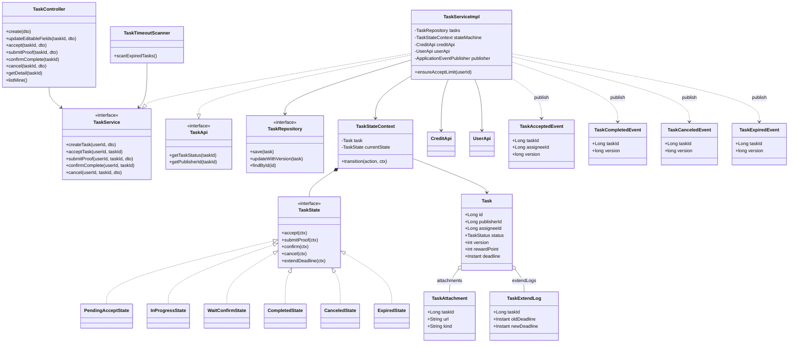
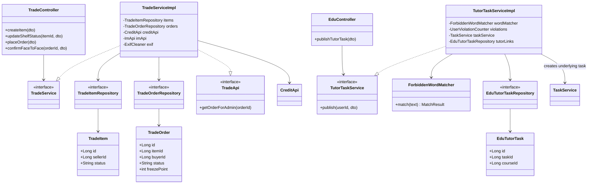
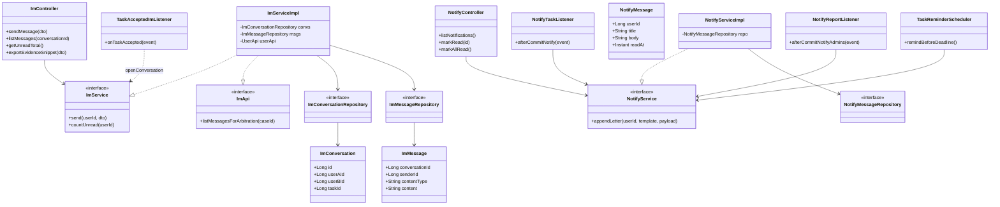
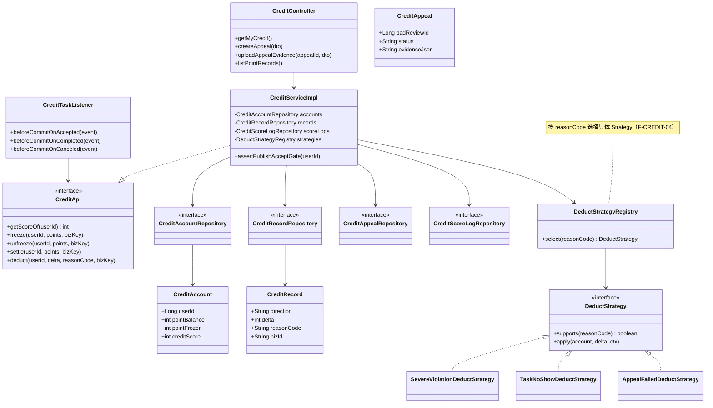
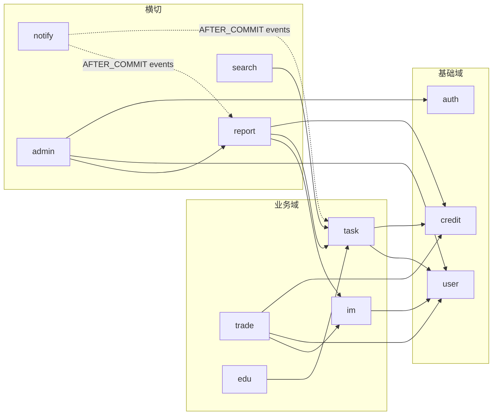

# P3 核心类图（P0 范围）

> **渲染说明：** 正文使用 **Mermaid `classDiagram`**。在 GitHub、VS Code（Markdown 预览）、Cursor 中可直接渲染。若需打印或复杂排版，可再导出为 PlantUML（`docs/P3/类图/` 目录可按需补图）。
>
> **依据：** [P2 架构设计文档](../P2/架构设计文档.md)（模块化单体、`XxxApi` + `ApplicationEvent`）、[P1 SRS](../P1/软件需求规格说明书.md)、[02_功能映射主表](./02_功能映射主表.md) 中 **✓（P0）** 行、[03_包结构骨架](./03_包结构骨架.md)。

---

## 1. P0 覆盖范围与分块策略

| 模块 | P0 行 | 类图分块 |
| :--- | :--- | :--- |
| `auth` | F-AUTH-01～06 | §3.1 |
| `user` | F-USER-01～04 | §3.1 |
| `common` | 跨模块 DTO/异常/响应包装 | §3.1 |
| `task` | F-TASK-01～09、11、12（不含 F-TASK-10 ★） | §3.2 |
| `trade` | F-TRADE-01～04 | §3.3 |
| `edu` | 仅 **F-EDU-05**（辅导发布 + 违禁词） | §3.3 |
| `im` | F-IM-01、02、04～07 | §3.4 |
| `notify` | F-NOTIFY-01～04 | §3.4 |
| `credit` | F-CREDIT-01、03～08（不含 F-CREDIT-02 ◇） | §3.5 |
| `report` | F-REPORT-01～05 | §3.6 |
| `admin` | F-ADMIN-01～04、06、07 | §3.6 |
| `search` | **F-SEARCH-01** | §3.6 |
| `team` | 功能映射表中均为 ★ | **本期类图不展开**（P1 延后），互审前单独补图 |

**跨模块纪律（P2 不变量）：** 依赖仅指向他模块的 **`*Api` 接口** 或 **进程内事件**；禁止 `task` 注入 `credit.repository` 等。

---

## 2. 图例（UML 关系）

| 记号 | 含义 |
| :--- | :--- |
| `..|>` | 实现（implements） |
| `--|>` | 继承（extends） |
| `-->` | 关联依赖（调用、注入） |
| `*--` | 组合（强拥有，如 Context 持有 State） |
| `o--` | 聚合（弱拥有，如 Task 持有 Attachment 列表） |

---

## 3.1 `common` + `auth` + `user`

```mermaid
classDiagram
  direction TB
  class PublicUserVO {
    +Long userId
    +String nickname
    +String avatarUrl
    +boolean verifiedTag
  }
  class ApiResponse {
    +String code
    +String message
    +Object data
    +String traceId
  }
  class BizException {
    +String code
    +String message
  }

  class AuthController {
    +sendCode(dto)
    +loginByCode(dto)
    +submitVerification(dto)
    +getVerifyStatus()
    +refreshToken(dto)
    +logout()
  }
  class AuthService {
    <<interface>>
    +sendSmsCode(phone, clientIp)
    +loginOrRegister(phone, code)
    +submitStudentVerification(userId, dto)
    +getVerificationStatus(userId)
    +refreshJwt(refreshToken)
  }
  class AuthServiceImpl {
    -SmsService sms
    -JwtService jwt
    -EventPublisher events
  }
  class SmsService {
    <<interface>>
    +send(phone, templateCode)
  }
  class JwtService {
    +issueAccessToken(userId)
    +issueRefreshToken(userId)
    +parse(token)
  }
  class AuthUser {
    +Long id
    +String phoneCipher
    +VerifyStatus verifyStatus
  }
  class AuthVerification {
    +Long id
    +Long userId
    +String status
    +String rejectReason
  }
  class AuthUserRepository {
    <<interface>>
  }
  class AuthVerificationRepository {
    <<interface>>
  }
  class UserVerifiedEvent {
    +Long userId
    +String ticketId
  }

  AuthController --> AuthService
  AuthServiceImpl ..|> AuthService
  AuthServiceImpl --> SmsService
  AuthServiceImpl --> JwtService
  AuthServiceImpl --> AuthUserRepository
  AuthServiceImpl --> AuthVerificationRepository
  AuthServiceImpl --> AuthUser
  AuthServiceImpl --> AuthVerification
  AuthServiceImpl ..> UserVerifiedEvent : publish

  class UserController {
    +updateProfile(dto)
    +updatePrivacy(dto)
    +getPublicProfile(userId)
    +getMyProfile()
  }
  class UserService {
    <<interface>>
    +updateNicknameAvatar(userId, dto)
    +updatePrivacyFlags(userId, dto)
    +getPublicUser(userId) PublicUserVO
    +getPrivateProfile(userId)
  }
  class UserServiceImpl {
    -UserProfileRepository profiles
    -UserAuditLogRepository audits
  }
  class UserProfile {
    +Long userId
    +String nickname
    +String avatarUrl
    +boolean hidePublishHistory
    +boolean hideAcceptHistory
    +boolean hideCourseReviews
  }
  class UserProfileRepository {
    <<interface>>
  }
  class UserAuditLogRepository {
    <<interface>>
  }
  class UserVerifiedEventListener {
    +onUserVerified(event)
  }

  UserController --> UserService
  UserServiceImpl ..|> UserService
  UserServiceImpl --> UserProfileRepository
  UserServiceImpl --> UserAuditLogRepository
  UserServiceImpl ..> PublicUserVO : builds
  UserVerifiedEventListener ..> UserService : refreshVerifiedTag
```

---

## 3.2 `task`（含 State 模式与事件）

---

## 3.3 `trade` + `edu`（P0：二手全流程 + 辅导发布）

---

## 3.4 `im` + `notify`

---

## 3.5 `credit`（含 Strategy 与监听）

> **说明：** `DeductStrategyRegistry` 可为 Spring 容器注入的 `List<DeductStrategy>` 封装类，或 `EnumMap` 工厂；类图中抽象为注册表以突出 **Strategy** 协作关系。

---

## 3.6 `report` + `admin` + `search`

```mermaid
classDiagram
  direction TB
  class ReportController {
    +submitReport(dto)
    +listMyReports()
  }
  class ReportService {
    <<interface>>
    +submit(userId, dto)
    +buildArbitrationWorkbench(caseId)
    +executeDecision(adminId, dto)
  }
  class ReportServiceImpl {
    -ReportCaseRepository cases
    -ReportDecisionRepository decisions
    -TaskApi taskApi
    -TradeApi tradeApi
    -ImApi imApi
    -CreditApi creditApi
    -ApplicationEventPublisher publisher
  }
  class ReportCase {
    +String targetType
    +Long targetId
    +String status
  }
  class ReportDecision {
    +Long caseId
    +Long adminId
    +String decision
  }
  class ReportCaseRepository {
    <<interface>>
  }
  class ReportDecisionRepository {
    <<interface>>
  }
  class ReportSubmittedEvent {
    +Long caseId
    +String targetType
  }
  class BadReviewSettledEvent {
    +Long reviewId
    +String outcome
  }

  ReportController --> ReportService
  ReportServiceImpl ..|> ReportService
  ReportServiceImpl --> ReportCaseRepository
  ReportServiceImpl --> ReportDecisionRepository
  ReportServiceImpl --> TaskApi
  ReportServiceImpl --> TradeApi
  ReportServiceImpl --> ImApi
  ReportServiceImpl --> CreditApi
  ReportServiceImpl ..> ReportSubmittedEvent
  ReportServiceImpl ..> BadReviewSettledEvent

  class AdminVerificationController {
    +approve(ticketId, dto)
    +reject(ticketId, dto)
  }
  class AdminUserController {
    +banUser(dto)
    +unbanUser(dto)
  }
  class AdminContentController {
    +listForbiddenHits()
    +resolveHit(hitId, dto)
  }
  class AdminArbitrationController {
    +getCaseDetail(caseId)
    +postDecision(caseId, dto)
  }
  class AdminAuditAspect {
    +record(operation)
  }
  class AdminOperationLogRepository {
    <<interface>>
  }

  AdminVerificationController --> AuthService
  AdminUserController --> UserService
  AdminContentController --> TutorTaskService
  AdminArbitrationController --> ReportService
  AdminAuditAspect --> AdminOperationLogRepository

  class SearchController {
    +searchTasks(dto)
  }
  class SearchService {
    <<interface>>
    +searchHall(dto) Page
  }
  class SearchServiceImpl {
    -TaskApi taskApi
    -TaskSearchQueryMapper mapper
  }

  SearchController --> SearchService
  SearchServiceImpl ..|> SearchService
  SearchServiceImpl --> TaskApi
```

> **说明：** `Admin*` Controller 仅示意；实际可合并为 `AdminFacadeController` 分包路径 `/api/admin/**`，但必须遵守 P2：`@PreAuthorize` 与后台字段可见性规约。

---

## 4. 跨模块依赖总览（合法边）

---

## 5. P0 功能 ID → 核心类映射（索引）

| 功能 ID | 核心参与类（简写） |
| :--- | :--- |
| F-AUTH-01～06 | `AuthController`, `AuthServiceImpl`, `SmsService`, `JwtService`, `AuthUserRepository`, `AuthVerificationRepository` |
| F-USER-01～04 | `UserController`, `UserServiceImpl`, `UserProfileRepository`, `UserAuditLogRepository`, `PublicUserVO` |
| F-TASK-01～09,11,12 | `TaskController`, `TaskServiceImpl`, `TaskRepository`, `TaskStateContext`, `TaskState*`, `CreditApi`, `UserApi`, `Task*Event`, `TaskTimeoutScanner` |
| F-TRADE-01～04 | `TradeController`, `TradeServiceImpl`, `TradeItemRepository`, `TradeOrderRepository`, `CreditApi`, `ImApi` |
| F-EDU-05 | `EduController`, `TutorTaskServiceImpl`, `ForbiddenWordMatcher`, `EduTutorTaskRepository`, `TaskService` |
| F-IM-01～02,04～07 | `ImController`, `ImServiceImpl`, `ImConversationRepository`, `ImMessageRepository`, `TaskAcceptedImListener`, `ImApi` |
| F-NOTIFY-01～04 | `NotifyController`, `NotifyServiceImpl`, `NotifyMessageRepository`, `NotifyTaskListener`, `TaskReminderScheduler` |
| F-CREDIT-01,03～08 | `CreditController`, `CreditServiceImpl`, `CreditApi`, `Credit*Repository`, `DeductStrategy*`, `CreditTaskListener` |
| F-REPORT-01～05 | `ReportController`, `ReportServiceImpl`, `Report*Repository`, `TaskApi`, `TradeApi`, `ImApi`, `CreditApi`, `ReportSubmittedEvent`, `BadReviewSettledEvent` |
| F-ADMIN-01～04,06,07 | `Admin*Controller`, `AuthService`, `UserService`, `ReportService`, `CreditApi`, `AdminOperationLogRepository`, `AdminAuditAspect` |
| F-SEARCH-01 | `SearchController`, `SearchServiceImpl`, `TaskApi` |

---

## 6. 变更记录

| 日期 | 变更 |
| :--- | :--- |
| 2026-05-12 | 初版：P0 类图分块、Mermaid 表达、team 延后说明 |
