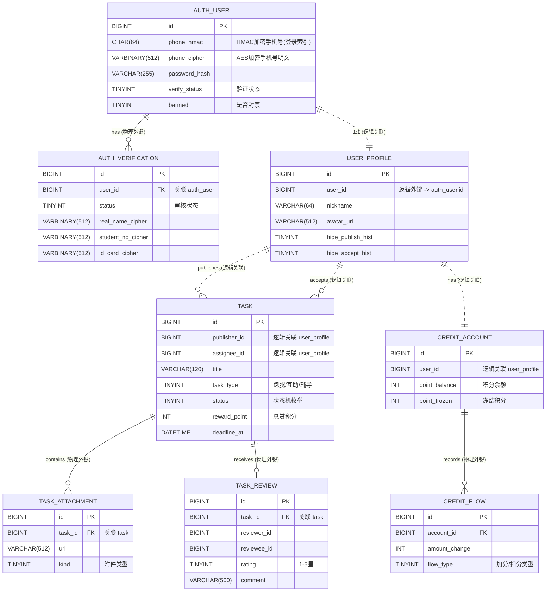

# P3 ER 图与数据库设计

> **渲染说明：** 正文使用 **Mermaid `erDiagram`**。在 GitHub、VS Code（Markdown 预览）中可直接渲染。
>
> **设计依据：** [P2 架构设计文档](../P2/架构设计文档.md)、[04_核心类图](./04_核心类图.md)、[schema.sql](./数据库/schema.sql) 以及 `01_统一规约.md`。

---

## 1. 核心 ER 图 (Entity-Relationship Diagram)

根据项目“跨模块无物理外键 (Foreign Key) 约束”的架构原则，数据库实际的物理外键仅存在于模块内部从表与主表之间（例如 `task` 与 `task_attachment`）。跨模块的关联（如 `task` 关联 `auth_user`）以逻辑外键处理。图中虚线表示逻辑外键，实线表示物理外键（或强所属关系）。

## 2. 设计规范说明

1. **隐私与加密原则（P1 硬性约束）：** 
   - 数据库严禁存储明文手机号、真实姓名和学号。
   - `auth_user` 表中的 `phone_hmac` 用于等值查询索引（登录匹配）。
   - 实名认证涉及数据在 `auth_verification` 表中以 `VARBINARY` 形式进行 AES-256 加密存储。
2. **逻辑外键（跨模块解耦）：** 
   - `user_profile.user_id` 和 `task.publisher_id` 为逻辑外键，数据库层面不建立强 FK 约束，保证服务隔离与可扩展性。
3. **资金安全化限制：** 
   - `credit_account` 和 `credit_flow` 仅使用整型（积分）字段，严禁出现代表真实法币金额的属性（如 BigDecimal/Money 类型）。
4. **主键与通用字段（统一规约）：**
   - 全部表统一使用 `BIGINT id AUTO_INCREMENT` 为主键。
   - 全部表隐藏了公共审计字段（`version`, `created_at`, `updated_at`, `deleted_at` 等，详见 `schema.sql`），保证绘图核心清晰。
