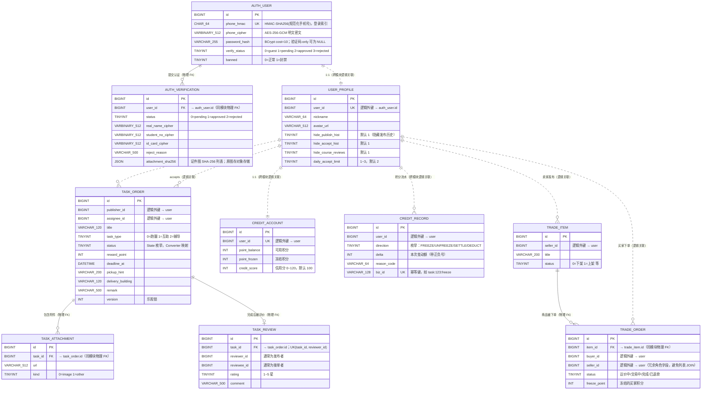

# P3 ER 图与数据库设计

> **渲染说明：** 正文使用 **Mermaid `erDiagram`**。在 GitHub、VS Code（Markdown 预览）中可直接渲染。
>
> **设计依据：** [P2 架构设计文档](../P2/架构设计文档.md)、[04_核心类图](./04_核心类图.md)、[schema.sql](./数据库/schema.sql)、[索引说明](./数据库/索引说明.md)、`01_统一规约.md` §3。
>
> **与 `schema.sql` 的对齐说明：** ER 图实体名采用大写以符合 Mermaid 习惯，对应物理表名见每个实体说明；字段名与 `schema.sql` 完全一致（snake_case）。审计字段（`version / created_at / updated_at / deleted_at / creator_id / updater_id`）所有表统一，图中省略以保证可读性，详见 §3。

---

## 1. 核心 ER 图 (Entity-Relationship Diagram)

根据项目“跨模块无物理外键 (FOREIGN KEY) 约束”的架构原则（`01_统一规约.md` §3.3），数据库实际的物理外键仅存在于**同前缀模块内部**从表与主表之间。跨模块的关联（如 `task_order` 关联 `auth_user`）以**逻辑外键**处理（应用层校验，不入 DB 约束）。

- 图中 `||--o{` / `||--o|` / `||--||` = 物理外键（同模块内部）
- 图中 `||..o{` / `||..||` = 逻辑外键（跨模块，无 DB 约束）

> **覆盖范围：** 本图聚焦 P0 范围内的 8 个核心表 + 2 个跨模块逻辑关联热点。次要模块（`im_*`、`notify_*`、`report_*`、`admin_*`、`edu_*`、`team_*`、`wall_*`）在 P3 阶段不画进核心 ER 图，后续随交付迭代补图，参考 [03_包结构骨架.md §5](./03_包结构骨架.md) 的总表清单。

---

## 2. 设计规范说明

### 2.1 隐私与加密原则（P1 NFR-SEC-02 硬性约束）

- 数据库**严禁存储明文手机号、真实姓名、学号、证件号**。
- `auth_user.phone_hmac`：HMAC-SHA256(规范化手机号)，用于登录等值查询；`phone_cipher` 仅用于审计回放。
- `auth_verification` 中实名 / 学号 / 证件号统一为 `VARBINARY` + **AES-256-GCM** 加密；业务表禁止冗余以上字段。
- `password_hash` 仅落 `auth_user`，**BCrypt cost=10**；详见 `01_统一规约.md` §2.5.2 与 `决策记录.md` D3-02。

### 2.2 跨模块外键禁令（`01_统一规约.md` §3.3 / P2 INV-02）

- ER 图中 `||..` 关系一律为**逻辑外键**，DB 层**不**建立物理 FK：`user_profile.user_id`、`task_order.publisher_id`、`credit_account.user_id`、`trade_item.seller_id` 等。
- 仅同模块前缀内允许物理 FK：`auth_verification → auth_user`、`task_attachment → task_order`、`task_review → task_order`、`trade_order → trade_item`。

### 2.3 资金/积分安全限制

- `credit_account.point_balance / point_frozen / credit_score` 与 `credit_record.delta` 一律 `INT NOT NULL`；
- **禁止**出现代表真实法币金额的 `DECIMAL / Money` 类型。这与 P1 / ADR 中"无真实支付，仅校园虚拟积分"的硬性边界一致。

### 2.4 枚举存储（`01_统一规约.md` §3.4 / 决策记录 D3-01）

- `verify_status / banned / status / task_type / direction / kind / rating` 等枚举字段统一 `TINYINT NOT NULL`。
- Java 侧强制 `@Convert(converter = XxxStatusConverter.class)`，**严禁** `@Enumerated(EnumType.ORDINAL)`；业务代码禁止使用枚举裸数字字面量。

### 2.5 主键与审计字段（统一规约 §3.1 / §3.2）

- 全表统一 `BIGINT id AUTO_INCREMENT`（Java 类型 `Long`）。
- 全表统一审计字段集：`version / created_at / updated_at / deleted_at / creator_id / updater_id`，详见 `schema.sql`，ER 图为可读性省略。

### 2.6 索引主路径

| 表 | 关键索引 | 服务的查询 |
| :--- | :--- | :--- |
| `auth_user` | `uk_auth_user_phone_hmac`、`idx_auth_user_verify_status` | 登录等值匹配、管理端审核队列 |
| `auth_verification` | `(status, created_at)`、`(user_id)` | 审核工作台、用户查询本人最新状态 |
| `user_profile` | `uk_user_profile_user_id`、`nickname` | 1:1 关联、昵称辅助检索 |
| `task_order` | `(publisher_id, status)`、`(assignee_id, status)`、`(status, deadline_at)`、`created_at` | 我的发布/接单、大厅筛选、超时扫描、时间序分页 |
| `task_review` | `uk_task_review_task_reviewer`、`(reviewee_id, created_at)` | 防重复评价、被评价人维度统计 |
| `credit_account` | `uk_credit_account_user_id`、`credit_score` | 1:1 账户、信用分阈值过滤 |
| `credit_record` | `uk_credit_record_biz`、`(user_id, created_at)` | 幂等保证、流水分页 |
| `trade_item` / `trade_order` | `(seller_id, status)` / `(buyer_id, status)` / `(seller_id, status)` / `(item_id)` | 上下架管理、买卖双方订单列表、商品-订单联查 |

> 完整 DDL 与索引细节见 [数据库/schema.sql](./数据库/schema.sql) 与 [数据库/索引说明.md](./数据库/索引说明.md)；AI 辅助审查见 [数据库/AI辅助审查_数据库设计.md](./数据库/AI辅助审查_数据库设计.md)。

---

## 3. 变更记录

| 日期 | 变更 |
| :--- | :--- |
| 2026-05-12 | 初版 ER 图（auth/user/task/credit 部分） |
| 2026-05-14 | 与 `schema.sql` 对齐：`TASK → TASK_ORDER`（统一规约 §3.4）；`CREDIT_FLOW → CREDIT_RECORD`（字段 `delta/direction/reason_code/biz_id`）；补 `TRADE_ITEM`、`TRADE_ORDER`；补 `user_profile.hide_course_reviews / daily_accept_limit`；显式区分物理 FK 与逻辑外键的连线样式 |
